  <picture>
    <source media="(prefers-color-scheme: dark)" srcset="assets/hero-dark.svg">
    
  </picture>

## Tech I ship with

  <picture>
    <source media="(prefers-color-scheme: dark)" srcset="assets/tech-tier-dark.svg">
    
  </picture>

## Activity

  <picture>
    <source media="(prefers-color-scheme: dark)" srcset="assets/activity-dark.svg">
    
  </picture>

